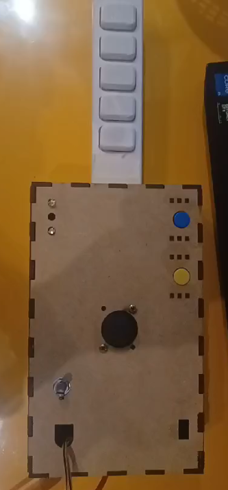
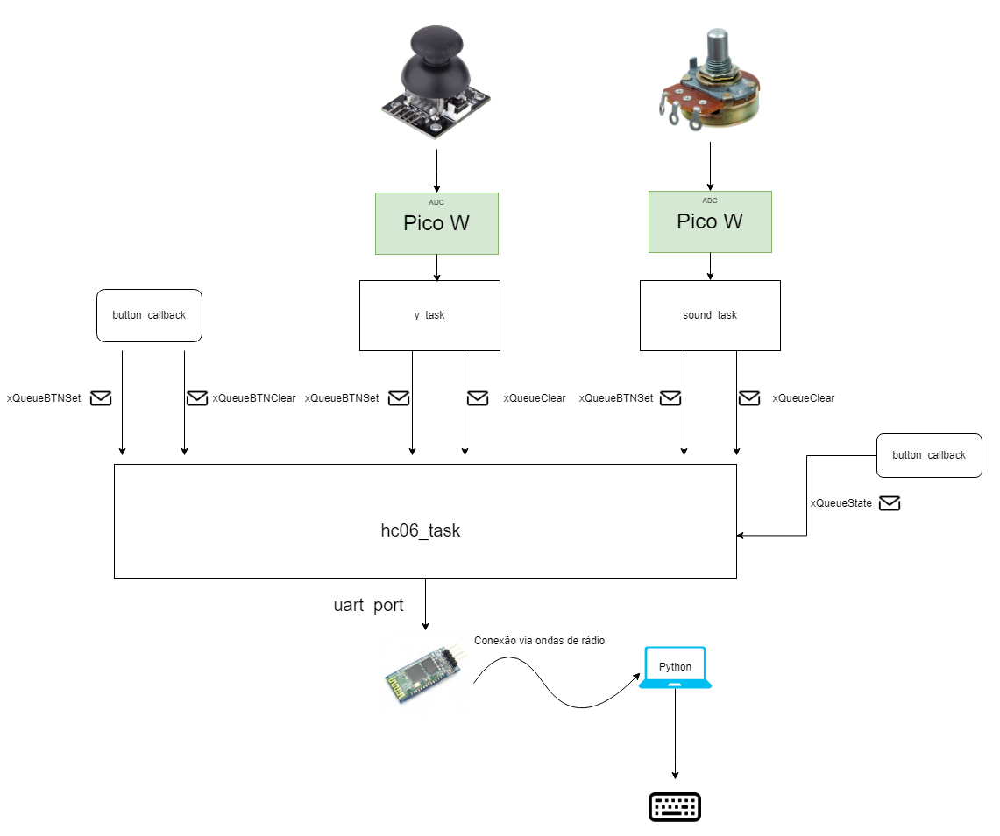

# APS 2 Computação Embarcada: Controle de Guitar Hero

Este projeto demonstra a interação entre botões, sensores analógicos e um módulo Bluetooth HC06 utilizando o sistema operacional FreeRTOS em uma placa Pico. O código é organizado em tasks e utiliza filas para comunicação entre elas. Tudo isso foi utilizado para simular um controle de Guitar Hero, onde os botões e sensores analógicos são utilizados para simular os botões de um teclado e deixar a interação com o jogo maior.

### Integrantes

- **Henrique Fazzio Badin**
- **Eduardo Selber Castanho**

### Foto do Dispositivo

### Vídeo de Demonstração

[Vídeo de Demonstação](https://www.youtube.com/watch?v=NUJswSWtMAg)

### Bibliotecas Utilizadas

- **Serial** (UART): Utilizada para comunicação serial com o módulo Bluetooth HC06.
- **Uinput**: Utilizada para simular a entrada de teclas no sistema operacional.
- **FreeRTOS**: Utilizada para gerenciar as tasks e filas do projeto.
- Bibliotecas padrão da Pico e de códigos C.
- Bibliotecas de interrupção e de ADC.

### Funcionalidades

- O controle é conectado a uma bateria que, quando se ativa um switch, liga o controle e o deixa pronto para ser conectado ao computador.
- Leitura do estado de 7 botões (A, S, J, K, L, H, ALT + F4)
- Leitura de 2 sensores analógicos (Um analógico que simula uma paleta e um potenciômetro que atua como um regulador de som)
- Detecção de quando se está pressionando e quando se solta o botão
- Envio dos dados combinados dos botões e sensores através do módulo Bluetooth HC06
- Indicação visual do estado da conexão Bluetooth (LED azul aceso)

### Componentes Utilizados

- **Microcontrolador:** Pico (RP2040)
- **Botões:** 7 botões (A, S, J, K, L, H, ALT + F4)
- **Sensores Analógicos:** 2 sensores analógicos (Analógico de controle e Potenciômetro)
- **Módulo Bluetooth:** HC06
- **LEDs:** 1 LED RGB

### Descrição dos Componentes

- **Botões:** Os botões são conectados como entradas digitais (GPIO). A interrupção por borda é utilizada para detectar o pressionamento e liberação dos botões.
- **Sensores Analógicos:** Os sensores analógicos são conectados a pinos ADC (conversor analógico-digital) do microcontrolador. A função `adc_read` converte a tensão lida do sensor em um valor digital.
- **Módulo Bluetooth HC06:** O módulo Bluetooth HC06 é configurado para comunicação serial com a placa Pico. A task `hc06_task` é responsável por enviar os dados combinados dos botões e sensores através da UART.
- **LEDs:** Um LED verde é utilizado para indicar o estado da conexão Bluetooth (azul aceso quando conectado, verde piscando quando pronto para conectar).

### Diagrama do projeto

### Descrição das Tasks

- **`hc06_task`:** Esta task inicializa a comunicação serial com o módulo Bluetooth HC06, recebe dados da fila `xQueueState` para atualizar o LED de status da conexão e lê as filas `xQueueBTNSet` e `xQueueBTNClear` para empacotar os dados dos botões e sensores. Por fim, envia os dados empacotados através da UART.
- **`y_task`:** Esta task lê o sensor analógico `ADC_y`. Quando o analógico é colocado em uma das extremidades do eixo y, um dado é enviado para a queue `xQueueBTNSet` e quando o analógico volta para uma região central um dado que cancela a informação anterior é enviada na queue `xQueueBTNClear`.
- **`sound_task`:** Esta task lê o sensor analógico `ADC_Sound`. Quando o potenciômetro é girado até uma de suas extremidades, um dado é enviado para a queue `xQueueBTNSet` e quando o potenciômetro volta para uma região central um dado que cancela a informação anterior é enviada na queue `xQueueBTNClear`..
- **`btn_callback`:** Esta função de callback é chamada por interrupção sempre que ocorre uma mudança de estado (pressão ou liberação) em algum dos botões. O estado do botão pressionado é codificado em bytes e enviado para a fila adequada (`xQueueBTNSet` para pressão ou `xQueueBTNClear` para liberação).

### Descrição das Filas

- **`xQueueBTNSet`:** Esta fila é utilizada para enviar dados codificados em bytes de quais os botões/sesores que estão sendo atuando no momento.
- **`xQueueBTNClear`:** Esta fila é utilizada para enviar dados codificados em bytes de quais os botões/sensores que deixaram de atuar no momento, basicamente cancelando as informações que deixam de acontecer.
- **`xQueueState`:** Esta fila é utilizada para enviar o estado da conexão Bluetooth (conectado ou desconectado) para a task `hc06_task` atualizar o LED de status.
